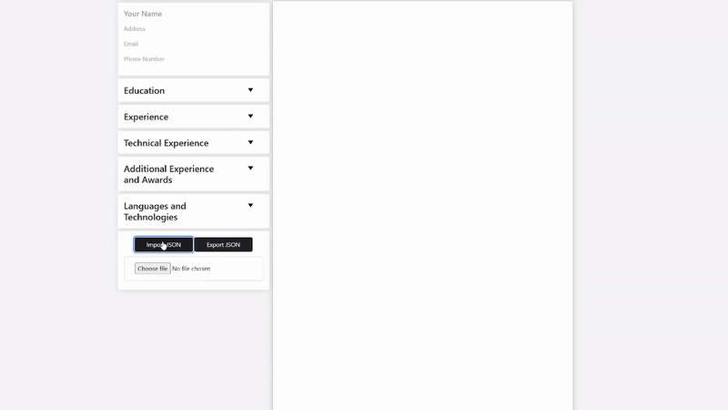
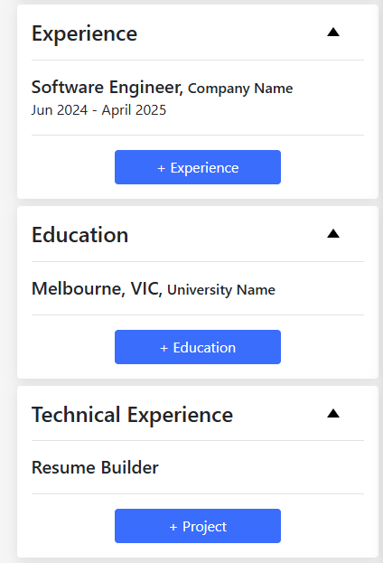
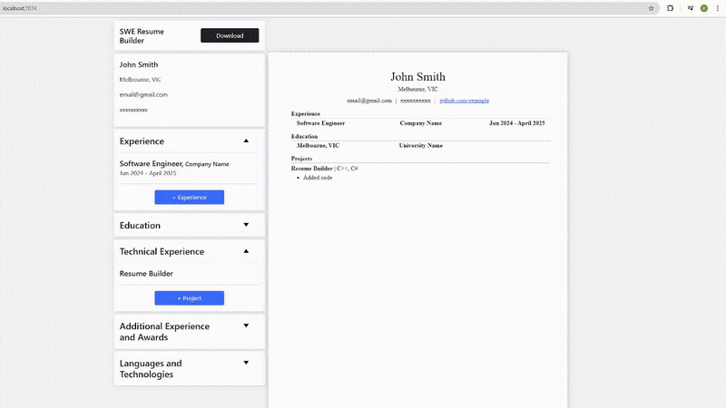
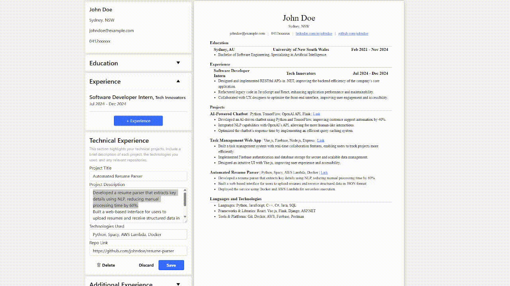

# Resume Builder 

The Resume Builder is a full-stack web application that allows users to create, edit, and download their resumes in PDF format. 
  The app features real-time editing, a live preview, and PDF export functionality to help users easily craft professional resumes.

## Table of Contents
- [Main Features](#main-features)
  - [Simplified Structure](#simplified-structure) 
  - [PDF Export Functionality](#pdf-export-functionality)
  - [Real-Time Editing](#real-time-editing)
  - [JSON Import/Export](#json-importing-and-exporting) 
- [Technologies Used](#technologies-used)

## Main Features

### Simplified Structure
The user interface is designed to provide a straightforward, easy-to-navigate experience that highlights key features without unnecessary complexity.

### PDF Export Functionality
Once the resume is complete, users can export it as a professional PDF for download, ready to be shared or printed.

### Real-Time Editing
Users can see changes instantly as they make edits, enabling a seamless experience while creating or modifying their resumes.

### JSON Importing and Exporting
Users are able to import/export existing resumes or data from a JSON file, allowing them to quickly start editing without manually re-entering information. This feature ensures that users are able to update or refine their resumes efficiently, while also laying the foundation for future database storage. 

## Technologies Used
- **jQuery & JavaScript**: Used for simplifying DOM manipulation and event handling in the web application, used for user interactions and provide dynamic content updates.
- **C#**: Utilized for server-side development, particularly for handling PDF generation in the Resume Builder Web App. It allowed for the development of efficient back-end functionality and seamless integration with PDFsharp for creating downloadable resumes.
- **PDFsharp**: Used in the Resume Builder Web App to generate and export resumes as PDF documents. PDFsharp helped in dynamically creating PDF files from user input, ensuring the app could offer a professional, shareable resume format.
